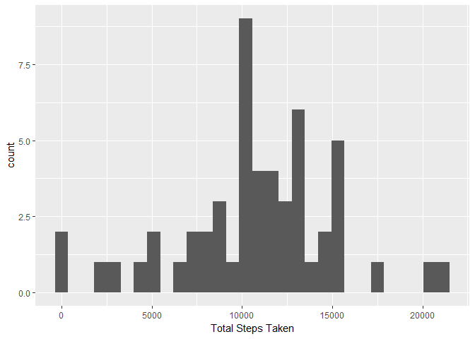

First we load the required packages

```r
library(dplyr)
```

```
## 
## Attaching package: 'dplyr'
```

```
## The following objects are masked from 'package:stats':
## 
##     filter, lag
```

```
## The following objects are masked from 'package:base':
## 
##     intersect, setdiff, setequal, union
```

```r
library(ggplot2)
```

```
## Warning: package 'ggplot2' was built under R version 3.4.3
```

Loading the data and making the date variable into the date type (instead of the factor variable that it was originally)


```r
data <- read.csv("activity.csv")
data$date <- as.Date(data$date, "%Y-%m-%d")
```

Total Number of Steps Taken per day

```r
data <- data[complete.cases(data),]
data <- group_by(data, date)
sum <- summarize(data, total_steps = sum(steps))
```

We should now have an object called "sum" which contains the total steps taken each day


```r
qplot(sum$total_steps, geom = "histogram", xlab = "Total Steps Taken")
```

```
## `stat_bin()` using `bins = 30`. Pick better value with `binwidth`.
```

<!-- -->

Calculating the mean and median of the total number of steps taken per day


```r
mean_steps <- mean(sum$total_steps)
median_steps <- median(sum$total_steps)
mean_steps
```

```
## [1] 10766.19
```

```r
median_steps
```

```
## [1] 10765
```

The mean seems to be 10766.188 and the median seems to be 10765 steps.

Onto creating the timeseries plot with "interval" on the x axis and average steps taken over the number of days on the y axis.


```r
data_grp_int <- group_by(data, interval)
sum_int <- summarize(data_grp_int, avg = sum(steps))


qplot(sum_int$interval, sum_int$avg, geom = "line", xlab = "Interval", ylab = "Average Steps Taken")
```

<!-- -->

```r
max_steps <- max(sum_int$avg)
interval_maxsteps <- sum_int[sum_int$avg == max(sum_int$avg),]
interval_maxsteps
```

```
## # A tibble: 1 x 2
##   interval   avg
##      <int> <int>
## 1      835 10927
```

It seems that interval 835 has the maximum average steps.

To see how many missing values the dataset has, we'll reload the dataset and then use is.na


```r
data <- read.csv("activity.csv")
data$date <- as.Date(data$date, "%Y-%m-%d")

sum(is.na(data))
```

```
## [1] 2304
```

```r
summary(data)
```

```
##      steps             date               interval     
##  Min.   :  0.00   Min.   :2012-10-01   Min.   :   0.0  
##  1st Qu.:  0.00   1st Qu.:2012-10-16   1st Qu.: 588.8  
##  Median :  0.00   Median :2012-10-31   Median :1177.5  
##  Mean   : 37.38   Mean   :2012-10-31   Mean   :1177.5  
##  3rd Qu.: 12.00   3rd Qu.:2012-11-15   3rd Qu.:1766.2  
##  Max.   :806.00   Max.   :2012-11-30   Max.   :2355.0  
##  NA's   :2304
```

It seems like we have 2304 missing values (all within the steps variable)
WE'll impute these missing values with the mean of the steps variable across all observations.

We then save that dataset as a csv file named as "data_no_na.csv"


```r
data$steps <- replace(data$steps, is.na(data$steps), mean(data$steps, na.rm = TRUE))

write.table(data, file = "data_no_na.csv")
```

Since our new "data" object has the missing values imputed, we can use the same code as before to make the histogram and find the mean and medians


```r
data <- group_by(data, date)
sum <- summarize(data, total_steps = sum(steps))
qplot(sum$total_steps, geom = "histogram", xlab = "Total Steps Taken")
```

```
## `stat_bin()` using `bins = 30`. Pick better value with `binwidth`.
```

<!-- -->

```r
mean_steps <- mean(sum$total_steps)
median_steps <- median(sum$total_steps)
mean_steps
```

```
## [1] 10766.19
```

```r
median_steps
```

```
## [1] 10766.19
```

Now the mean and median both come to 10766.19 which are fairly small changes from what we saw earlier. The interesting thing is that the mean and median are the same now.

Now to create a factor variable which indicates if a given date is a weekday or a weekend


```r
data$days_of_week <- weekdays(data$date)

weekdays <- c("Monday", "Tuesday", "Wednesday", "Thursday", "Friday")

data$weekday <- factor((data$days_of_week %in% weekdays), levels = c(FALSE, TRUE), labels = c("Weekend", "Weekday"))
```

Now to construct the linegraph discribed


```r
data_grpintweek <- group_by(data, interval, weekday)
sum_int <- summarize(data_grpintweek, avg = sum(steps))
ggplot(data = sum_int, aes(x = interval, y = avg)) + geom_line() + facet_grid(weekday~.)
```

<!-- -->
